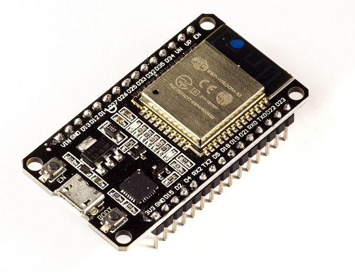
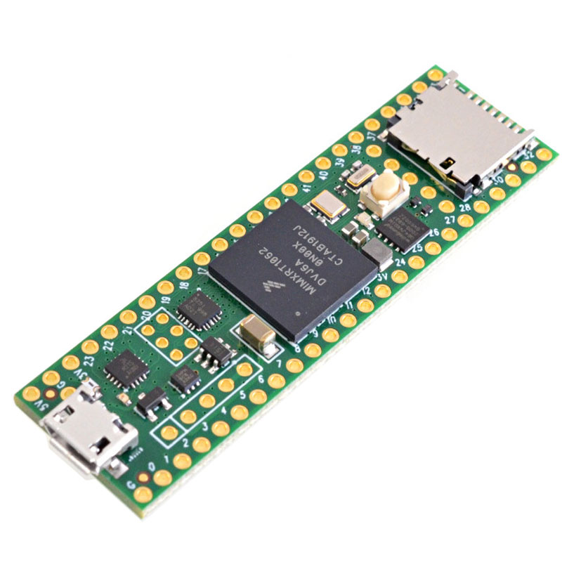

# Rules 

1. A coastal town is flooded, affecting the entire area. Water has entered homes, forcing
residents to evacuate or take shelter on rooftops without food, water, or medicines.
Severe weather initially hindered relief efforts, but after 48 hours, the rain has stopped,
and the wind speed has reduced. However, water levels remain high, leaving many
people trapped and stranded on their rooftops. National Disaster Response Force
(NDRF) and Local Administration teams are ready to start rescue efforts.

2. Teams must build two drones to:
    1. Scan an area of 30 hectares to locate survivors while sending real-time video.
    2. Geotag survivors and communicate to them via a speaker mounted on the drone.
    3. Deploy a delivery drone to deliver survival kits (Size: 5x10x20cm; Weight: 200 gms).
3. Scanning and geotagging survivors is considered as Part 1 of the mission and delivering
survival kits is considered as Part 2 of the mission.

4. Each team may build one drone as a “Scout Drone” for scanning and locating survivors
and another drone as a “Delivery Drone” for delivering survival kits.

5. Teams may also consider building both drones as a combination of “Scout+Delivery
Drone”. The solution strategy shall remain flexible for teams.

6. Both drones must fly autonomously while reporting their status and mission details
from a single command and control station.

7. However, teams shall also have the option to operate both drones manually with
different command and control stations by accepting a Penalty as outlined in the
subsequent section of this document.

## My Idea 

My idea pertains mostly to the technical side of things. 

For the scouting drone , since it requires a camera and image processing, I was thinking we can use a Raspberry Pi with a PiCamera as it's main control unit. As for the Geotagging, we can use a GPS module to find out it's current location and then use it's latitude and longitude and mark places where stranded people were found. 

For the delivery drone, we can use a normal microcontroller like an ESP32 or a Teensy both of which require low power, but provide high processing power. In addition, the 2 microcontrollers have the following additional features: 

### ESP32 

It is a small, low-cost microcntroller that is powered by a Dual core Xtensia processor. It provides in-built Bluetooth and Wi-Fi capabilities and it has 32 GPIO pins which provides a platform for multiple connections. 

#### ESP32 Specifications :

1. 32-bit Dual-core Xtensia processor operating at 160-240 MHz 
2. 520kB on-chip SRAM 
3. 448kB ROM 
4. Supports IEEE 802.11 Wi-Fi standards and offers upto 150Mb/s 
5. Supports both Bluetooth Classic and Bluetooth Low Energy (BLE)
6. Interfaces include : 
    1. 4 SPI (Serial Peripheral Interface)
    2. 2 I2C (Inter-Integrated Circuit)
    3. 3 UART (Universal Asynchronous Receiver-Transmitter) 
7. 32 Multifunctional GPIO pins 
8. 10 Capacitive Touch Sensors (in-built). 
9. Hall Effect Sensor (in-built)

### Teensy 4.1

It is a small, very-powerful microcontroller that is powered by an ARM Cortex-M7 processor. It has an in-built microSD card slot for data storage and has 55 GPIO pins. 

#### Teensy 4.1 Specification

1. ARM Cortex M-7 Processor operating at 600 MHz
2. 1MB of RAM 
3. 8MB of Flash Memory 
4. 1 microSD card slot 
5. Ethernet connectivity 
6. 55 GPIO Pins 
7. Interfaces include :
    1. 3 SPI 
    2. 3 CAN (Controller Area Network) Buses. 
    3. 8 UART ports 
    4. 3 I2C 

The above 2 microcontrollers are mainly for the "Delivery Drone". 

